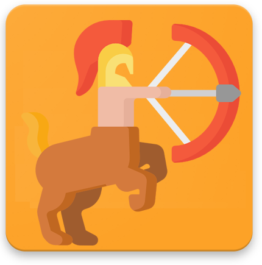

#  quiron_new
Projeto para desenvolver os conhecimentos em C# e .NET Core.

# ⚙️ Recursos
 
 
 
 
 
 
 
 
 
 
 
 
 
 
 

# 📚 Artigos (Atualizar):
<a href='https://medium.com/@glerystonmatos/apresenta%C3%A7%C3%A3o-projeto-quiron-706485e4dc74'>Apresentação do projeto</a> 
<a href='https://medium.com/@glerystonmatos/entity-framework-core-postgresql-3205533fbc31'>Mudando o banco de dados para PostgreSQL</a> 
<a href='https://medium.com/@glerystonmatos/deploy-de-uma-aplica%C3%A7%C3%A3o-net-core-3-1-no-heroku-b2224b2b3e03'>Automatizando deploy no Heroku</a> 
<a href='https://medium.com/@glerystonmatos/verificar-a-cobertura-dos-testes-unit%C3%A1rios-em-projetos-net-core-com-coverlet-f5baff06578d'>Verificando a cobertura dos testes unitários</a> 
<a href='https://medium.com/@glerystonmatos/automatiza%C3%A7%C3%A3o-de-testes-de-api-com-postman-90f55cd35b9'>Automatização dos testes com Postman</a> 
<a href='https://medium.com/@glerystonmatos/automa%C3%A7%C3%A3o-de-processos-com-github-actions-3efdeaf4919c'>Automação de Processos com GitHub Actions</a> 
<a href='https://medium.com/@glerystonmatos/auto-mapper-com-net-core-9d09856059b3'>Auto Mapper com .Net Core</a>

# 📧 Contatos:
<a href="https://www.linkedin.com/in/glerystonmatos/" target="_blank">Gleryston Matos</a> 
glerystonmatos@yahoo.com.br 
glerystonmatos@gmail.com 

# ⚠️ Licença
`quiron` é um projeto livre e de código aberto licenciado sob a [MIT License](./LICENSE).